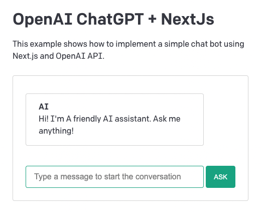

## OpenAI ChatGPT + NextJs

This example shows how to implement a simple chat bot using Next.js and [OpenAI API](https://beta.openai.com/docs/api-reference/completions/create).

Online Demo: https://next-openai-chatgpt.vercel.app



### Set up environment variables

- rename [`.env.example`](.env.example) to `.env.local`:

```bash
cp .env.example .env.local
```

- update `OPENAI_API_KEY` with your [OpenAI](https://beta.openai.com/account/api-keys) secret key.

```js
OPENAI_API_KEY = xxxxx;
```

### Development

```js
npm install
npm run dev

# or

yarn
yarn dev
```

View the app at http://localhost:3000
